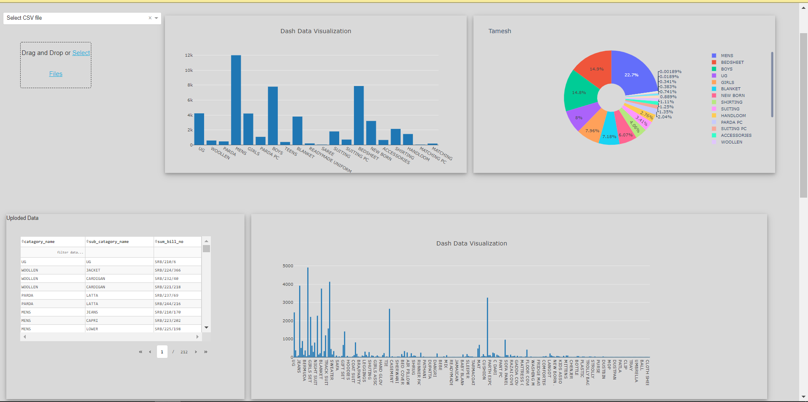

# Pyhton-Dash-based-MBA-Dashboard

 Market Basket analysis system and data visualization  dashboard is developed using python that will give insight about the uploaded transaction data using  interactive plots and graph

### Prerequisite  
  * python
  * dash(library)
  * Apriori Algorithm
  
### Dashboard contains
  * Input field, that take transaction data as input from csv file or database.
  * Data table, that show list of all record from enterd data and give functionality to filter data.
  * Interective graphs and plots for data vissulizaion.
  * Drop down filter graphs
  * Heat map for Market Bakset Anlysis.
  
  
  
### Result

  

